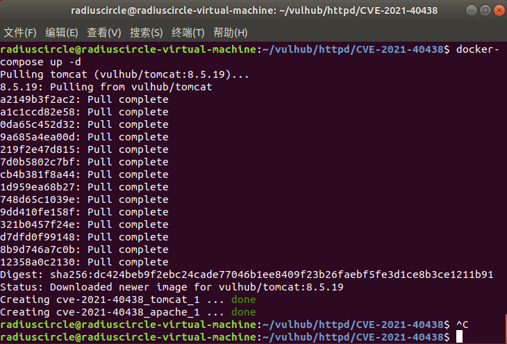

# Apache HTTP Server 2.4.48 mod_proxy SSRF （CVE-2021-40438）

## 漏洞原理

Apache HTTP Server项目是为包括UNIX和Windows在内的现代操作系统开发和维护开源HTTP服务器的努力。

在httpd的mod_proxy中发现了服务器端请求伪造 （SSRF） 漏洞。此漏洞允许未经身份验证的远程攻击者将请求转发到任意服务器。攻击者可以获取、修改或删除其他服务上的资源，这些资源可能位于防火墙后面，否则无法访问。此缺陷的影响因httpd网络上可用的服务和资源而异。

## 影响版本

Apache HTTP Server ≤ 2.4.48

## 复现机器版本

攻击机：Ubuntu18.04

靶机：Ubuntu18.04 Docker version 20.10.10

## 漏洞复现

### 准备阶段 

#### 进入靶场，启动服务

```
cd /home/radiuscircle/vulhub/httpd/CVE-2021-40438
docker-compose build
docker-compose up -d
```



#### 信息收集

查看端口

```
docker ps
```


可以看到打开了8080端口

### 漏洞利用

访问本地ip的8080端口


此时apache做了反向代理


### 关闭容器

```
docker-compose down
```

