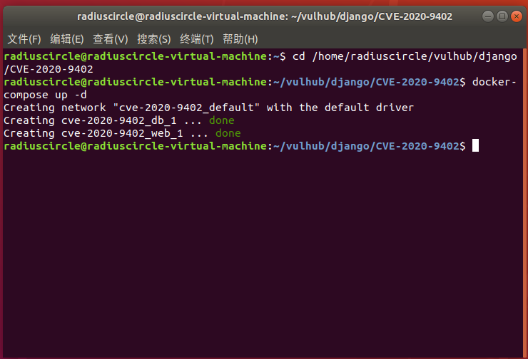
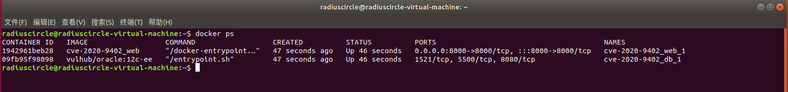

# Django GIS SQL注入漏洞（CVE-2020-9402）

## 漏洞原理

Django是Django基金会的一套基于Python语言的开源Web应用框架。该框架包括面向对象的映射器、视图系统、模板系统等。 Django 1.11.29之前的1.11.x版本、2.2.11之前的2.2.x版本和3.0.4之前的3.0.x版本中存在SQL注入漏洞。攻击者可借助特制的SQL语句利用该漏洞查看、添加、修改或删除数据库中的信息。开发者使用了GIS中聚合查询的功能，用户在oracle的数据库且可控tolerance查询时的键名，在其位置注入SQL语句。

## 影响版本

1.11.29之前的1.11.x版本
 	  2.2.11之前的2.2.x版本
	   3.0.4之前的3.0.x版本

## 复现机器版本

攻击机：Ubuntu18.04

靶机：Ubuntu18.04 Docker version 20.10.10

## 漏洞复现

### 准备阶段 

#### 进入靶场，启动服务

```
cd /home/radiuscircle/vulhub/django/CVE-2020-9402
docker-compose up -d
```



#### 信息收集

查看端口

```
docker ps
```




### 漏洞利用

访问IP：

### 关闭容器

```
docker-compose down
```

