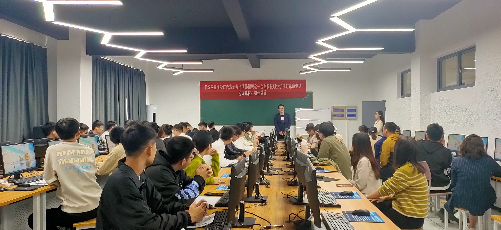

# H3C结业仪式暨招聘会

10月29日上午，信息工程学院“新华三云网融合订单班”结业仪式在图书馆报告厅举行。本次结业仪式由韩嫣老师主持，我院院长汪国华、杭州洪铭通信技术有限公司董事长张黎明、学院党总支书记黄林国出席了本次仪式，2021级新华三云网融合订单班班长夏文博以及全体新华三订单班的同学参加了本次活动。

在结业仪式上，汪国华院长发表了讲话，他肯定了同学们不惧困难的学习态度，也对即将步入工作的同学提出了几点建议：希望同学们在外也能做好安全工作，同时也能继续认真学习，为明年的顶岗实习和毕业论文做更充足的准备；端正就业态度，在外保持良好的台科院形象，既为自己，也为学校争光；最后对同学们表示祝贺，也预祝大家都能找到心仪的工作。

随后，由杭州洪铭张黎明董事长致辞，他表示新华三订单班毕业同学前途广阔，也同样希望同学们在接下来的工作中能够转变意识，积累经验，明确自己的目的。他对同学们的学业与事业表示看好与祝福。

接着，学员代表夏文博同学结合自身的实际经历进行了发言。他回顾三个月来的学习生活，对其间虽然历经坎坷，但大家最终都能坚持到底并学有所成感到很骄傲。同时，他对学校领导与授课老师在学习过程中的关怀与指导表示了感谢，也对家人与朋友的鼓励与帮助心存谢意。

仪式的最后，进行了新华三云网融合订单班奖学金的颁发，这既是对同学们辛苦学习的肯定，也是对未来工作的激励。希望同学们能向他们学习，努力汲取知识，成为祖国明日的栋梁。

下午，在实1219教室举办了新华三订单班专场招聘会，来自全省各地的13家企业参与了此次活动，他们先详细介绍了企业的状况，并与同学们进行了深入的交流。各公司均向学生提供了网路售后工程师、网络工程师、网络管理员、IT运维、售前工程师等20多个热门岗位，最终招聘会在热烈的气氛中顺利进行。值得一提的是，本次的面试官中有好几名为我院往届的毕业生，这充分体现了我院学生的优良工作能力。

