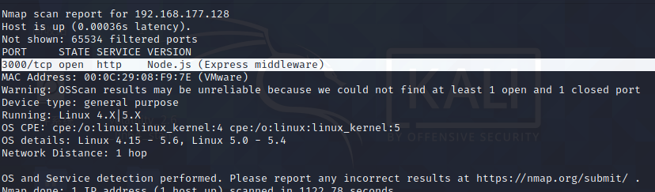

# Node-postgres 代码执行漏洞（CVE-2017-16082）

## 漏洞原理

node-postgres 在处理类型为'Row Description'的 postgres 返回包时，将字段名拼接到代码中。由于没有进行合理转义，导致一个特殊构造的字段名可逃逸出代码单引号限制，造成代码执行漏洞。

## 影响版本

pg@2.x to pg@7.1.0

## 复现机器版本

攻击机：Ubuntu18.04

靶机：Ubuntu18.04 Docker version 20.10.10

## 漏洞复现

### 准备阶段

#### 启动靶场

```
cd /home/radiuscircle/vulhub/node/CVE-2017-14849
docker-compose up -d
```


#### 信息收集

使用nmap 对靶机进行扫描，查看所开放的端口，以及扫描数据库的版本信息

```
sudo nmap -T4 -sV -O -p- 192.168.177.128
```


