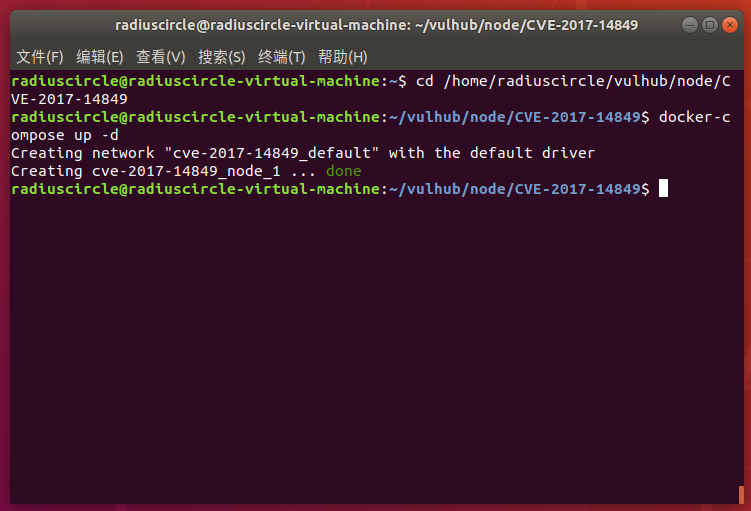
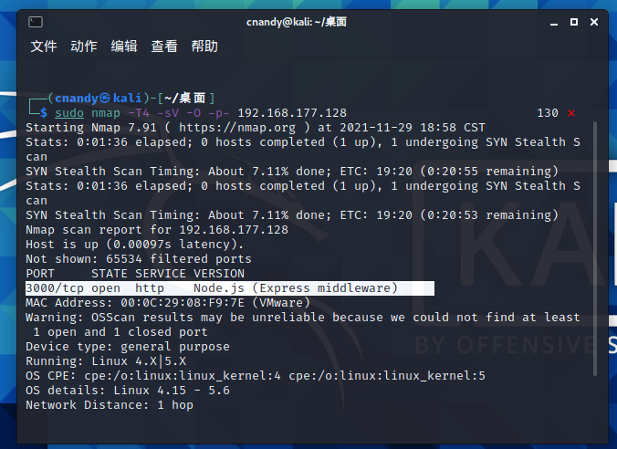
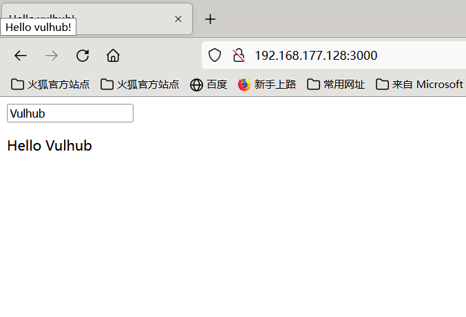
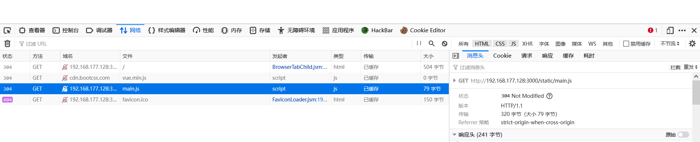
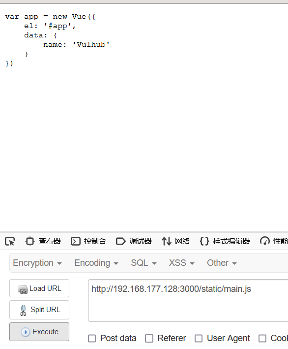
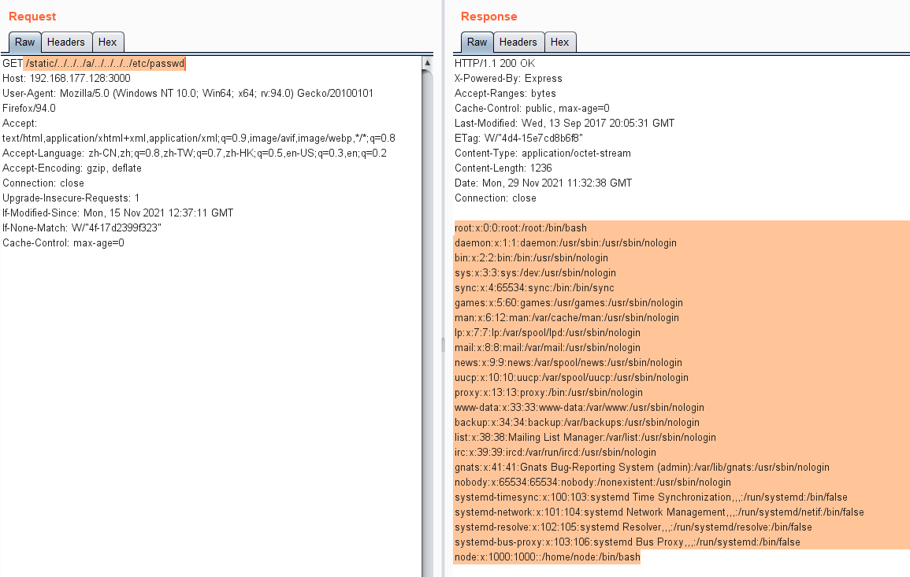

# Node.js 目录穿越漏洞（CVE-2017-14849）

## 漏洞原理

原因是Node.js 8.5.0 对目录进行normalize操作时出现了逻辑错误，导致向上层跳跃的时候（如…/…/…/…/…/…/etc/passwd），在中间位置增加foo/…/（如…/…/…/foo/…/…/…/…/etc/passwd），即可使normalize返回/etc/passwd，但实际上正确结果应该是…/…/…/…/…/…/etc/passwd。

express这类web框架，通常会提供了静态文件服务器的功能，这些功能依赖于normalize函数。比如，express在判断path是否超出静态目录范围时，就用到了normalize函数，上述BUG导致normalize函数返回错误结果导致绕过了检查，造成任意文件读取漏洞。

## 影响版本

 Node.js 8.5.0 + Express 3.19.0-3.21.2

Node.js 8.5.0 + Express 4.11.0-4.15.5

## 复现机器版本

攻击机：Ubuntu18.04

靶机：Ubuntu18.04 Docker version 20.10.10

## 漏洞复现

### 准备阶段

#### 启动靶场

```
cd /home/radiuscircle/vulhub/node/CVE-2017-14849
docker-compose up -d
```



#### 

#### 信息收集

使用nmap 对靶机进行扫描，查看所开放的端口，以及扫描数据库的版本信息

```
sudo nmap -T4 -sV -O -p- your_ip
```



可以看到目标靶机开启了3000端口

访问



### 漏洞利用

我们可以看到，该网页引用了/static/main.js文件，说明其存在静态文件服务器



访问该文件，可以看到文件内容如下



使用burpsuit进行抓包，然后修改访问路径



### 关闭容器

```
docker-compose down
```

