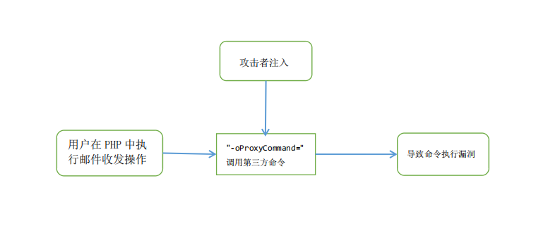
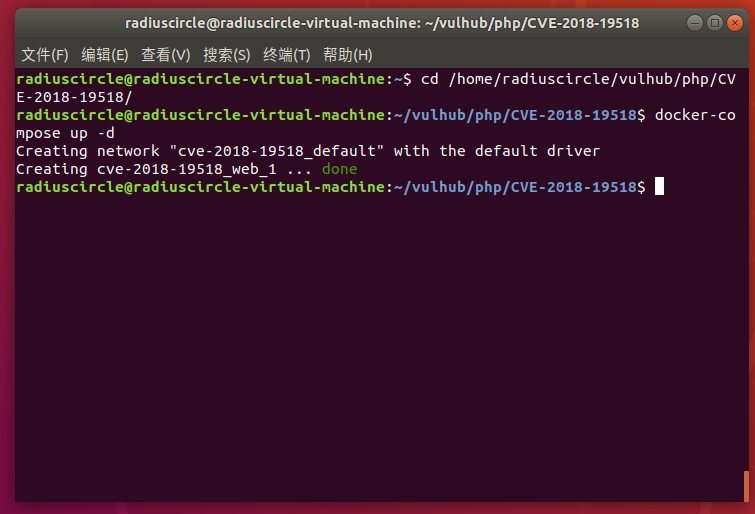
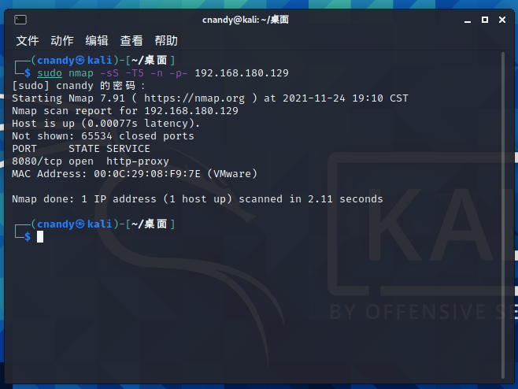
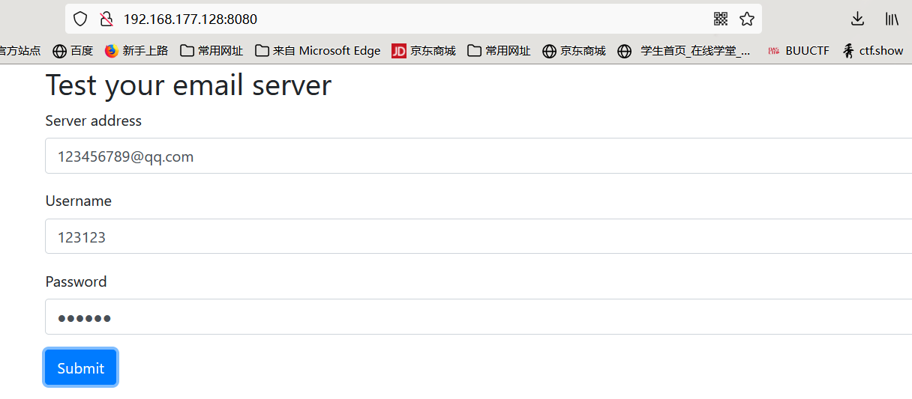
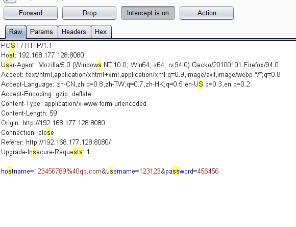
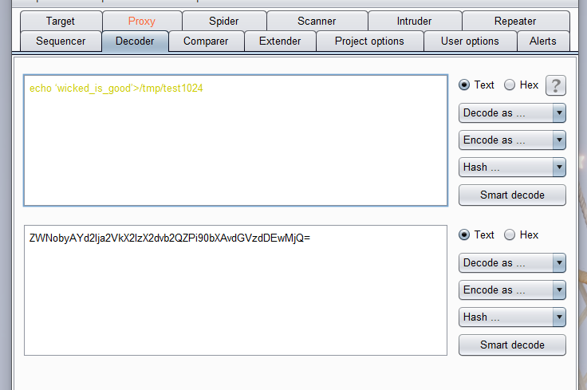
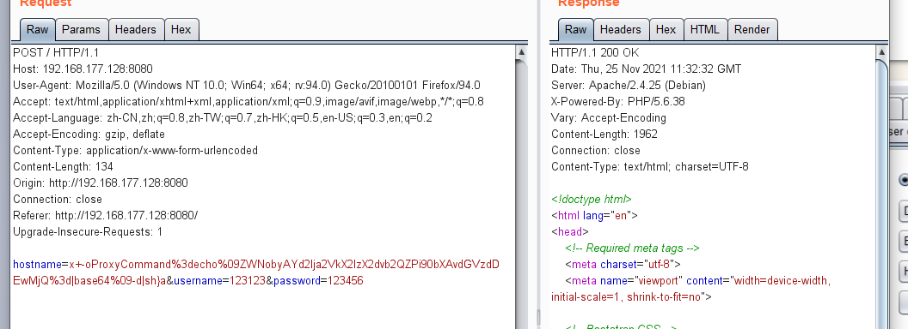
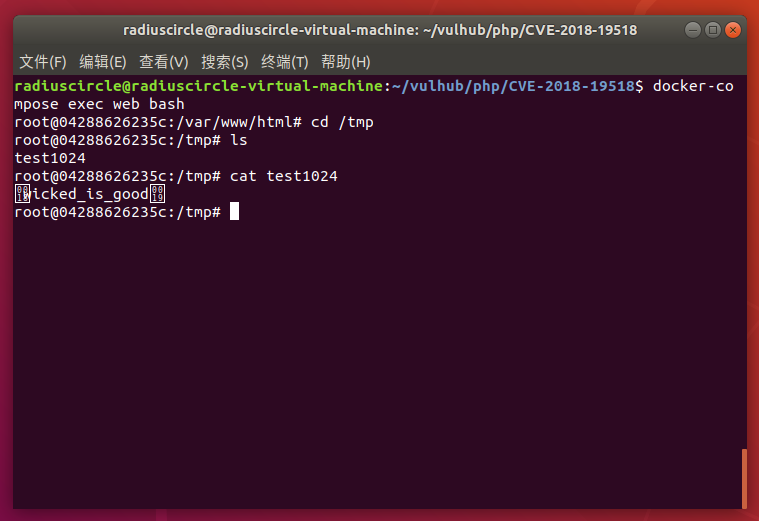

# PHP imap远程命令执行漏洞（CVE-2018-19518）

## 漏洞描述

php imap扩展用于在PHP中执行邮件收发操作。其`imap_open`函数会调用rsh来连接远程shell，而debian/ubuntu中默认使用ssh来代替rsh的功能（也就是说，在debian系列系统中，执行rsh命令实际执行的是ssh命令）。

因为ssh命令中可以通过设置`"-oProxyCommand=`"来调用第三方命令，攻击者通过注入注入这个参数，最终将导致命令执行漏洞。

## 漏洞原理



## 影响版本

PHP：5.6.38

系统：Debian/ubuntu

## 复现机器版本

攻击机：Ubuntu18.04

靶机：Ubuntu18.04 Docker version 20.10.10

## 漏洞复现

### 准备阶段

#### 启动靶场

```
cd /home/radiuscircle/vulhub/php/CVE-2018-19518/
docker-compose up -d
```



#### 信息收集

使用nmap工具对目标靶机的端口进行扫描

```
sudo nmap -sS -T5 -n -p- your_ip
```



发现目标主机开启了8080端口

### 漏洞利用

对靶机进行web页面访问

```
your_ip:8080
```



随意构造邮箱、用户名与密码后，使用burpsuit工具进行抓包



抓包成功后，将数据包发送给Repeater，对数据包进行修改，添加执行代码。

`"imap_open(string $mailbox , string $username , string $password)`''函数中的"mailbox"是执行命令参数的一部分，所以我们可以通过更改邮箱名来进行命令注入执行。

构造一个payload：



需注意：

1、对需要执行的代码要进行base64编码，其中一些符号需要url编码：+(%2b)、TAB(%09)、=(%3d)；

2、-oProxyCommand：-o 是ssh的参数，ProxyCommand是ssh的一个选项；

3、-oProxyCommand=echo，之后添加需要执行的经过base64编码之后的命令，由于bash或sh执行命令时需要进行base64解码后再输出到sh进行执行，因此后面还需要添加管道符。总体的格式为："-oProxyCommand=echo [base64_code] | base64 -d | sh"

4、“|”：管道符，将两个命令隔开，管道符左边命令的输出会作为右边命令的输入。



使用

```
docker-compose exec web bash
```

命令进入漏洞环境进行查看



执行成功

### 关闭容器

```
docker-compose down
```

