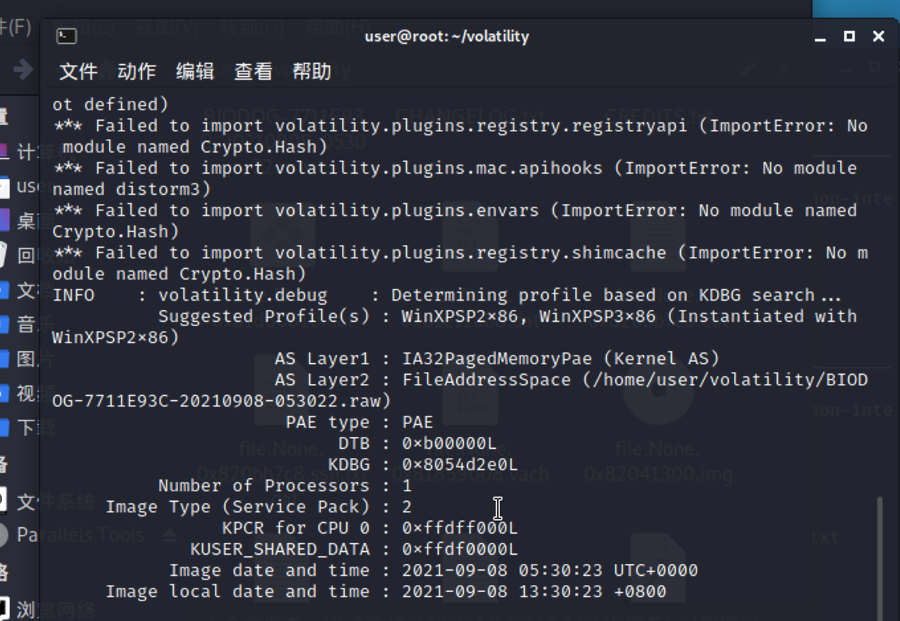
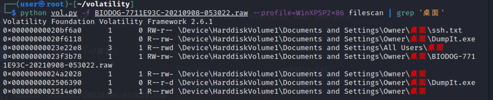
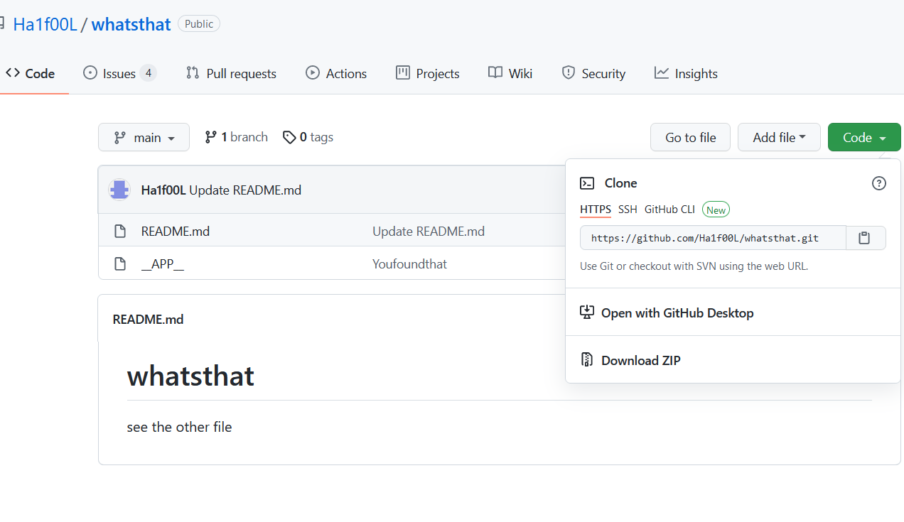
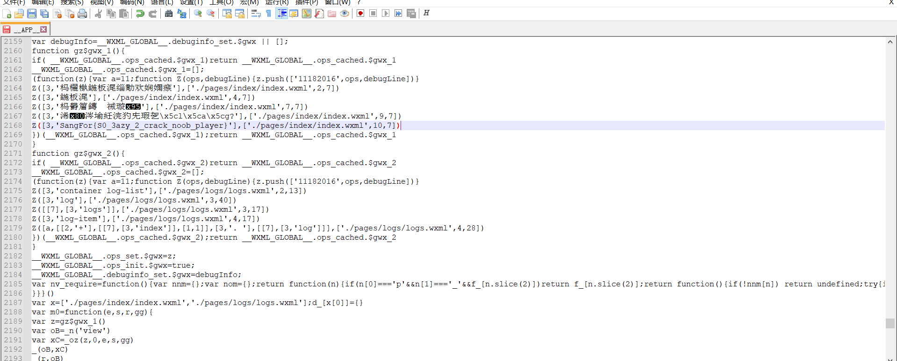

# 羊城杯-2021-网络安全大赛高职组-你问我我问谁战队-WP 之前一份不全，请以这份为准

## 1、签到题 ##


因为题目要求的数字范围是1-30，所以猜测是28


八卦图，猜测是08


而立之年，就是30岁，猜测是30


北斗七星，猜测是07


江南四大才子，猜测是04


歼20，猜测是20


两个黄鹂鸣翠柳，猜测是02


这图本来猜测是05，发现不是，仔细观察后才发现，“一起”谐音17


不用多说了，23


一马当先，猜测01


十二星座，猜测12


新闻联播，每天19：00首播，猜测19

连起来就是28-08-30-07-04-20-02-17-23-01-12-19


MD5加密后，得到flag

## 2、misc520 ##

先放提示


打开压缩包后发现里面套了好多压缩包


在150.zip中发现一半flag


依据提示，flag开头为GWHT

查表知，GWHT的ascii码为71、87、72、84

分析可知，为凯撒加密

解密得GWHT{W3lCom3_

全部解开后发现png图片


根据提示我们可以确定是lsb隐写

用StegSolve查看

发现red 0、green 0和blue 0三个通道存在异常


尝试解密，发现压缩包


保存分离后尝试打开，发现需要密码


仔细查看提示，没有发现与密码相关的信息，遂爆破


得到密码，解开压缩包

wireshrak打开后发现是usb数据

使用

```
tshark -r usb.pcap -T fields -e usb.capdata | sed '/^\s*$/d' > usbdata.txt
```

提取并去除空行后得到cap date数据


数据长度4个字节，所以是鼠标移动数据

在每个字节后加上冒号

```python
f=open('usbdata.txt','r')
fi=open('out.txt','w')
while 1:
    a=f.readline().strip()
    if a:
        if len(a)==8: # 鼠标流量的话len改为8，键盘改为16
            out=''
            for i in range(0,len(a),2):
                if i+2 != len(a):
                    out+=a[i]+a[i+1]+":"
                else:
                    out+=a[i]+a[i+1]
            fi.write(out)
            fi.write('\n')
    else:
        break

fi.close()
```

得到


使用脚本获取鼠标移动路径

```python
nums = []
keys = open('out.txt','r')
f = open('xyzp.txt','w')
posx = 0
posy = 0
for line in keys:
    if len(line) != 12 :
        continue
    x = int(line[3:5],16)
    y = int(line[6:8],16)
    if x > 127 :
        x -= 256
    if y > 127 :
        y -= 256
    posx += x
    posy += y
    btn_flag = int(line[0:2],16)  # 1 for left , 2 for right , 0 for nothing
    if btn_flag == 0 : # 1 代表左键
        f.write(str(posx))
        f.write(' ')
        f.write(str(posy))
        f.write('\n')

f.close()
```

得到左键与右键得移动路径

左键


右键


用gnuplot将`xy.txt与xyz.txt`里的坐标转化成图像


修整后得到两串数据

130 63 111 

与

94 51 114 139 146

与上面一样，是凯撒解密

得到t0_与M!sc}

组合后得到flag

Sangfor{W3lCom3_t0_M!sc}

## 3、Baby_Forenisc  ##

查看镜像



在桌面发现可疑信息



发现ssh，导出

解码base64，得到账户


在github上搜索邮箱，找到用户，下载文件



得到flag


