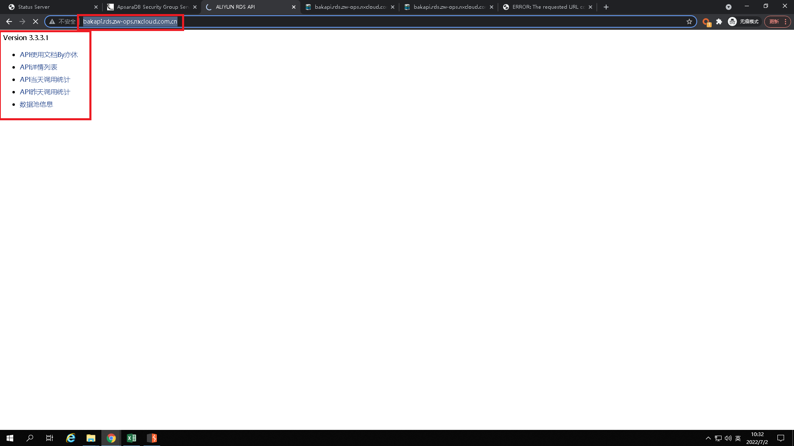
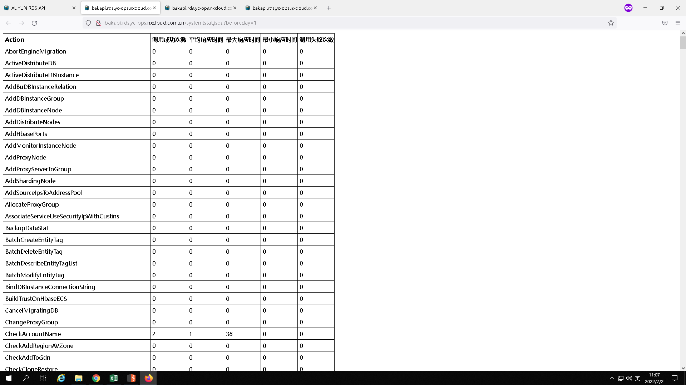

# 宁夏政务云 漏洞

## 【20220622】【http://172.31.170.5:8089/】[存在Slow HTTP Denial of Service Attack漏洞]

## **漏洞描述**

通过安全扫描与手工测试确认，部署在政务外网区的密码机存在Slow HTTP Denial of Service Attack漏洞。当恶意攻击者以很低的速率发起HTTP请求，使得服务端长期保持连接，这样使得服务端容易造成占用所有可用连接，导致拒绝服务。

**URL**

```
http://172.31.170.5:8089/
```

**漏洞详情**


正常访问所需时间为259ms


开启攻击


直至攻击结束，网页无法正常访问

**修复建议**

1.中断使用URL不支持HTTP方法访问的会话

2.限制HTTP头及包长至一个合理数值

3.设置一个绝对的会话超时时间

4.服务器支持backlog的情况下，需设置一个合理的大小

5.设置一个最小的入站数据传输速率


## 【20220622】【http://172.31.170.6:8089/】[存在Slow HTTP Denial of Service Attack漏洞]

**漏洞描述**

通过安全扫描与手工测试确认，部署在政务外网区的密码机存在Slow HTTP Denial of Service Attack漏洞。当恶意攻击者以很低的速率发起HTTP请求，使得服务端长期保持连接，这样使得服务端容易造成占用所有可用连接，导致拒绝服务。

**URL**

```
http://172.31.170.6:8089/
```

**漏洞详情**


正常访问所需时间为380ms


开启攻击


直至攻击结束，网页无法正常访问

**修复建议**

1.中断使用URL不支持HTTP方法访问的会话

2.限制HTTP头及包长至一个合理数值

3.设置一个绝对的会话超时时间

4.服务器支持backlog的情况下，需设置一个合理的大小

5.设置一个最小的入站数据传输速率


## 【20220623】【http://119.60.255.137:8089/】[存在Slow HTTP Denial of Service Attack漏洞]

**漏洞描述**

通过安全扫描与手工测试确认，部署在互联网区的密码机存在Slow HTTP Denial of Service Attack漏洞。当恶意攻击者以很低的速率发起HTTP请求，使得服务端长期保持连接，这样使得服务端容易造成占用所有可用连接，导致拒绝服务。

**URL**

```
http://119.60.255.137:8089/
```

**漏洞详情**


正常访问所需时间为400ms


开启攻击后


直至攻击结束，网页无法正常访问

**修复建议**

1.中断使用URL不支持HTTP方法访问的会话

2.限制HTTP头及包长至一个合理数值

3.设置一个绝对的会话超时时间

4.服务器支持backlog的情况下，需设置一个合理的大小

5.设置一个最小的入站数据传输速率


## 【20220623】【http://119.60.255.136:8089/】[存在Slow HTTP Denial of Service Attack漏洞]

**漏洞描述**

通过安全扫描与手工测试确认，部署在互联网区的密码机存在Slow HTTP Denial of Service Attack漏洞。当恶意攻击者以很低的速率发起HTTP请求，使得服务端长期保持连接，这样使得服务端容易造成占用所有可用连接，导致拒绝服务。

**URL**

```
http://119.60.255.136:8089/
```

**漏洞详情**


正常访问所需时间为423ms


开启攻击


直至攻击结束，网页无法正常访问

**修复建议**

1.中断使用URL不支持HTTP方法访问的会话

2.限制HTTP头及包长至一个合理数值

3.设置一个绝对的会话超时时间

4.服务器支持backlog的情况下，需设置一个合理的大小

5.设置一个最小的入站数据传输速率


## 【20220624】【https://119.60.255.133:8442】[存在Slow HTTP Denial of Service Attack漏洞]

**漏洞描述：**

通过安全扫描与手工测试确认，部署在互联网区的身份认证网关设备存在Slow HTTP Denial of Service Attack漏洞。当恶意攻击者以很低的速率发起HTTP请求，使得服务端长期保持连接，这样使得服务端容易造成占用所有可用连接，导致拒绝服务。

**URL**

```
https://119.60.255.133:8442
```

**漏洞详情**

1.访问https://119.60.255.133:8442/跳转至控件下载界面

   可见，此时正常访问所需时间为584ms


2、开始攻击


3、直至攻击结束，网页无法正常访问


**修复建议**

1.中断使用URL不支持HTTP方法访问的会话

2.限制HTTP头及包长至一个合理数值

3.设置一个绝对的会话超时时间

4.服务器支持backlog的情况下，需设置一个合理的大小

5.设置一个最小的入站数据传输速率


## 【20220624】【https://119.60.255.62:8443/login/login.htm】[存在TLS 1.0 enabled漏洞]

**漏洞描述**

通过安全扫描与手工测试确认，部署在互联网上的存在服务器TLS 1.0 enabled漏洞。攻击者可利用低版本TLS协议中的漏洞攻击系统。

**URL**

```
https://119.60.255.62:8443/login/login.htm
```

**漏洞详情**

查询可见，服务器支持较老的TLS1.0版本


**修复建议**

建议禁用低版本的TLS协议，仅支持TLS1.2及以上版本。


## 【20220624】【https://119.60.255.66:8443/login/login.htm】[存在TLS 1.0 enabled漏洞]

**漏洞描述**

通过安全扫描与手工测试确认，部署在互联网上的服务器存在TLS 1.0 enabled漏洞。攻击者可利用低版本TLS协议中的漏洞攻击系统。

**URL**

```
https://119.60.255.66:8443/login/login.htm
```

**漏洞详情**

查询可见，服务器支持较老的TLS1.0版本


**修复建议**

建议禁用低版本的TLS协议，仅支持TLS1.2及以上版本。


## 【20220624】【https://119.60.255.86:8443/login/login.htm】[存在TLS 1.0 enabled漏洞]

**漏洞描述**

通过安全扫描与手工测试确认，部署在互联网上的服务器存在TLS 1.0 enabled漏洞。攻击者可利用低版本TLS协议中的漏洞攻击系统。

**URL**

```
https://119.60.255.86:8443/login/login.htm
```

**漏洞详情**

查询可见，服务器支持较老的TLS1.0版本


**修复建议**

建议禁用低版本的TLS协议，仅支持TLS1.2及以上版本。


## 【20220624】【https://119.60.255.106:8443/login/login.htm】[存在TLS 1.0 enabled漏洞]

**漏洞描述**

通过安全扫描与手工测试确认，部署在互联网上的服务器存在TLS 1.0 enabled漏洞。攻击者可利用低版本TLS协议中的漏洞攻击系统。

**URL**

```
https://119.60.255.106:8443/login/login.htm
```

**漏洞详情**

查询可见，服务器支持较老的TLS1.0版本


**修复建议**

建议禁用低版本的TLS协议，仅支持TLS1.2及以上版本。


## 【20200701】【http://222.75.57.42/pages/login?ssoType=ding&originPath=%252F&callbackUrl=http%3A%2F%2F222.75.57.42%2FsendCodeToken.do#/】[存在Cookie中缺少HttpOnly标志漏洞]

**漏洞描述**

此cookie没有设置HTTPOnly标志。使用HTTPOnly标志设置Cookie时，它会指示浏览器Cookie只能由服务器访问，而不能由客户端脚本访问。这是会话cookie的重要安全保护。

**URL**

```
http://222.75.57.42/pages/login?ssoType=ding&originPath=%252F&callbackUrl=http%3A%2F%2F222.75.57.42%2FsendCodeToken.do#/
```

**漏洞详情**

如图服务器下发的cookie缺少HTTPOnly属性：


**修复建议**

基本上，cookie的唯一必需属性是“name”字段，必须设置“HttpOnly”属性，才能防止会话cookie被脚本访问。

### 【20220701】【http://iaas-adaptor.zw-ops.nxcloud.com.cn/】[内网IP泄露]

**URL**

```
http://iaas-adaptor.zw-ops.nxcloud.com.cn/
```


### 【20220701】【http://dubbo.zw.nxcloud.com.cn/】[目录遍历]

**URL**

```
http://dubbo.zw.nxcloud.com.cn/
```








